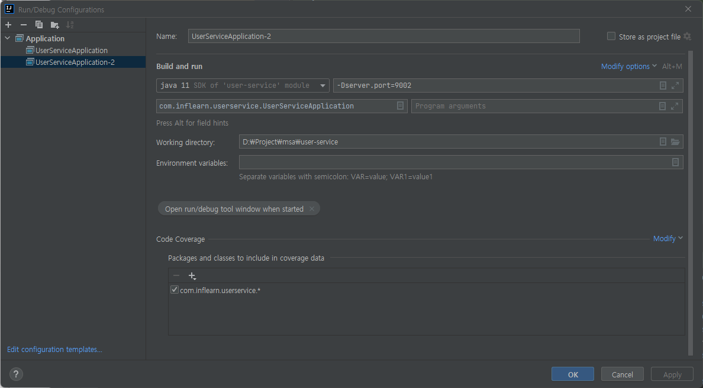

# User-Service

```yml
server:
  port: 9001

spring:
  application:
    name: user-service

eureka:
  client:
    register-with-eureka: true
    fetch-registry: true
    service-url: http://127.0.0.1:8761/eureka
```
- register-with-eureka, fetch-registry: Eureka Client로 사용하겠다.
- service-url: Eureka Server URL (http://127.0.0.1:8761/eureka)에 마이크로 서비스를 등록하겠다.

```java
package com.inflearn.userservice;

import org.springframework.boot.SpringApplication;
import org.springframework.boot.autoconfigure.SpringBootApplication;
import org.springframework.cloud.client.discovery.EnableDiscoveryClient;

@SpringBootApplication
@EnableDiscoveryClient
public class UserServiceApplication {

	public static void main(String[] args) {
		SpringApplication.run(UserServiceApplication.class, args);
	}

}

```

- @EnableDiscoveryClient: Eureka Client로 사용하겠다.


# Service 여러 개 실행하는 방법

### 방법1) 실행버튼

### 방법2) Edit Configuration

> Web server failed to start. Port 9001 was already in use.

- 포트를 설정안하면 포트 충돌 에러가 난다.



- Modify options -> Add VM options

### 방법3) 어플리케이션 빌드 후 커멘드에서 실행

> mvn spring-boot:run -Dspring-boot.run.jvmArguments='-Dserver.port=9003'

### 방법4) 터미널

> 1. mvn clean (빌드파일 삭제)
> 2. mvn compile package (타겟 폴더, 스냅샷 생성)
> 3. java -jar -Dserver.port=9004 ./target/user-service-0.0.1-SNAPSHOT.jar (빌드 파일 위치)


# 매번 포트부여하기 힘드니, 랜덤포트를 사용한다.

```yml
server:
  port: 0
```

- 0: 랜덤포트

> mvn spring-boot:run

- 현재 위치 pom.xml과 src를 인식해서 mvn이 빌드해서 실행한다. (0번 포트이니 랜덤포트로 실행)
- 그러나 랜덤포트로 여러번 실행해도 Eureka Dashboard에는 하나밖에 안 보인다. (Eureka는 spring.application.name + 0번포트 기준으로 보임)
```yml
eureka:
  instance:
    instance-id: ${spring.cloud.client.hostname}:${spring.application.instance_id:${random.value}}
```

- 이를 추가하면 인스턴스 기준으로 Eureka Dashboard에 보인다.