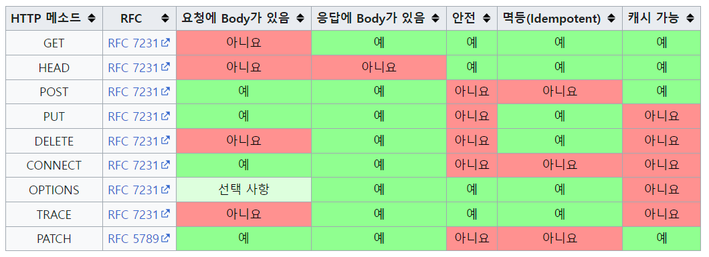

# 인터넷 프로토콜 4계층

    1. 프로그램이 Hello, World! 메시지 생성
        - 전송 데이터 (HTTP 메시지)

(App) 애플리케이션 계층 - HTTP, FTP

    2. (App) Socket 라이브러리를 통해 전달
        - TCP/IP 연결 (IP, Port)
        - 데이터 전달

(OS) 전송 계층 - TCP, UDP

    3. TCP 정보 생성, 메시지 데이터 포함
        - TCP 세그먼트: 출발지 Port, 목적지 Port, 전송 제어, 순서, 검증 정보 등

(OS) 인터넷 계층 - IP

    4. IP 패킷 생성, TCP 데이터 포함
        - IP 패킷: 출발지 IP, 목적지 IP, 기타 등

(HW) 네트워크 인터페이스 계층

    5. 인터넷 -> 서버

# IP (인터넷 프로토콜)

- 역할

  - 지정한 IP 주소(IP Address)에 데이터 전달
  - 패킷(Packet) 통신 단위로 데이터 전달

- 한계

  - 비연결성: 패킷 받을 대상 불능
  - 비신뢰성: 패킷 사라짐, 순서 안 맞음
  - 프로그램 구분: 같은 IP가 둘 이상

- 해결방법

  ## TCP (Transmission Control Protocol, 전송 제어 프로토콜)

  - 연결지향 - TCP 3 way handshake (가상 연결)
    - SYN > SYN + ACK > ACK
    - SYN: 접속 요청
    - ACK: 요청 수락
  - 데이터 전달 보증
  - 순서 보장
  - 신뢰할 수 있는 프로토콜
  - 현재 대부분은 TCP 사용

  ## UDP (User Datagram Protocol, 사용자 데이터그램 프로토콜)

  - 데이터 전달 및 순서가 보장되지 않지만 단순하고 빠름
  - IP와 거의 같다. **PORT** 체크섬 정도만 추가되어 있다.
    - 여러 애플리케이션 데이터가 들어올 때, 포트로 구분할 수 있다.
  - 애플리케이션에서 추가 작업 필요

  ## PORT

  - IP는 목적지 서버를 찾는 것, PORT는 서버 안에서 프로세스(애플리케이션)을 분류

  ## DNS (Domain Name Ssytem)

  - 도메인 명을 IP 주소로 변환

# URI (Uniform Resource Identifier)

- URI는 URL, URN 모두를 포함
- URL (Uniform Resource Locator): 리소스가 있는 위치를 지정
- URN (Uniform Resource Name): 리소스에 이름을 부여

# HTTP (HyperText Transfer Protocol)

- HTTP 메시지에 모든 것을 전송 (HTML, Text, Image, JSON 등)
- HTTP/1.1(RFC7230~7235): 우리가 사용하는 버전 (TCP 기반)
- 클라이언트-서버 구조 (Request-Response 구조)
- **무상태(Stateless) 프로토콜** (<-> Stateful, 상태 유지)
  - 서버가 클라이언트의 상태를 보존하지 않는다.
  - 장점
    - 서버 확장성 높음(무한한 서버 증설 가능) (스케일 아웃: 수평 확장 유리)
  - 단점
    - 클라이언트가 추가 데이터 전송
  - 상태 유지를 사용하는 경우
    - 로그인한 사용자의 경우 로그인 했다는 상태를 서버에 유지
    - 일반적으로 브라우저 쿠키와 서버 세션 등을 사용해서 상태 유지
    - 상태 유지는 최소한만 사용
- **비연결성(connectionless)**
  - 서버와 클라이언트는 연결을 유지하지 않는다. (최소한의 자원 유지)
    1. TCP/IP 연결
    2. 클라이언트: 요청
    3. 서버: 응답
    4. TCP/IP 연결 종료
  - 단점
    - TCP/IP 연결을 매번 새로 맺어야 함 (3 way handshake 시간 추가)
    - HTML뿐 아니라 JS, CSS, 이미지 등 함께 다운로드 해야함.
  - 지속 연결(Persistent Connections)로 단점 해결
- HTTP 메시지 구조
  - start-line, 시작 라인
    - Request: HTTP 메서드(GET, POST 등), 요청 대상, HTTP Version
    - Response: HTTP 버전, HTTP 상태 코드(200, 400, 500 등)
  - header, 헤더
    - HTTP 전송에 필요한 모든 부가정보
  - empty line, 공백 라인 (CRLF)
  - message body
    - 실제 전송할 데이터
    - HTML, 이미지, 영상 등 byte로 표현할 수 있는 모든 데이터 전송 가능
- 단순함, 확장가능

# HTTP 메서드

- API URI는 리소스로 식별
- 계층 구조상 상위를 컬렉셕으로 보고 복수단어 사용 권장
- 리소스만으로 안 되는 경우: 컨트롤 URI

  - 예) POST /orders/{orderId}/start-delivery (리소스/리소스 식별자/동사)

- 주요 메서드

  - GET: 리소스 조회
    - 서버에 전달하고 싶은 데이터는 query(쿼리 파라미터, 쿼리 스트링)을 통해 전달
    - 메시지 바디를 사용해서 데이터를 전달할 수 있지만, 지원하지 않는 곳이 많아 권장하지 않음
  - POST: 요청 데이터 처리, 주로 등록에 사용
    - 메시지 바디를 통해 서버로 요청 데이터 전달
    - 서버는 요청 데이터를 처리: 메시지 바디를 통해 들어온 데이터를 처리하는 모든 기능을 수행한다.
    - 단순히 데이터를 생성하거나, 변경하는 것을 넘어서 **프로세스를 처리해야 하는 경우 사용**
    - GET으로 조회데이터를 넘기기 어려운 경우도 가능 (특수한 경우)
      - 단, 조회는 GET으로 사용하는 것이 좋다. (서버끼리 약속하고 캐싱을 한다.)
    - 결론, POST는 모든 것이 가능
  - PUT: 리소스가 있으면 대체, 없으면 생성
    - POST와 차이점: 클라이언트가 리소스를 식별할 줄 안다. (/members/{memberId})
  - PATCH: 리소스 부분 변경
    - PUT과 차이점: PUT은 리소스를 대체하는 것으로, 이전에 존재했지만, 값을 안 주면 빈칸으로 업데이트 되지만, PATCH는 값을 안 주면 이전에 존재한 값을 유지하고 받은 값만 업데이트한다.
  - DELETE: 리소스 삭제

- 기타 메서드

  - HEAD: GET과 동일하지만 메시지 부분을 제외하고, 상태 줄과 헤더만 반환
  - OPTIONS: 대상 리소스에 대한 통신 가능 옵션(메서드)을 설명 (주로 CORS에서 사용)
  - CONNECT: 대상 자원으로 식별되는 서버에 대한 터널을 설정
  - TRACE: 대상 리소스에 대한 경로를 따라 메시지 루프백 테스트를 수행

- HTTP 메서드의 속성

	

- 안전(Safe Methods)

  - 호출해도 리소스를 변경하지 않는다.

- 멱등(Idempotent Methods)

  - 같은 요청을 한 번 호출하든 100번 호출하든 결과가 똑같다.
  - POST는 멱등이 아니다. 예) 결제 요청을 여러번 날리면 중복 결제된다.
  - 활용
    - 자동 복구 메커니즘
    - Response가 없을 때 클라이언트가 다시 요청해도 되는지 판단 근거

- 캐시가능(Cacheable Methods)
  - 실제로는 GET, HEAD 정도만 가능하다. POST, PATCH는 캐시 키를 고려해야하는데 구현이 쉽지 않다.
